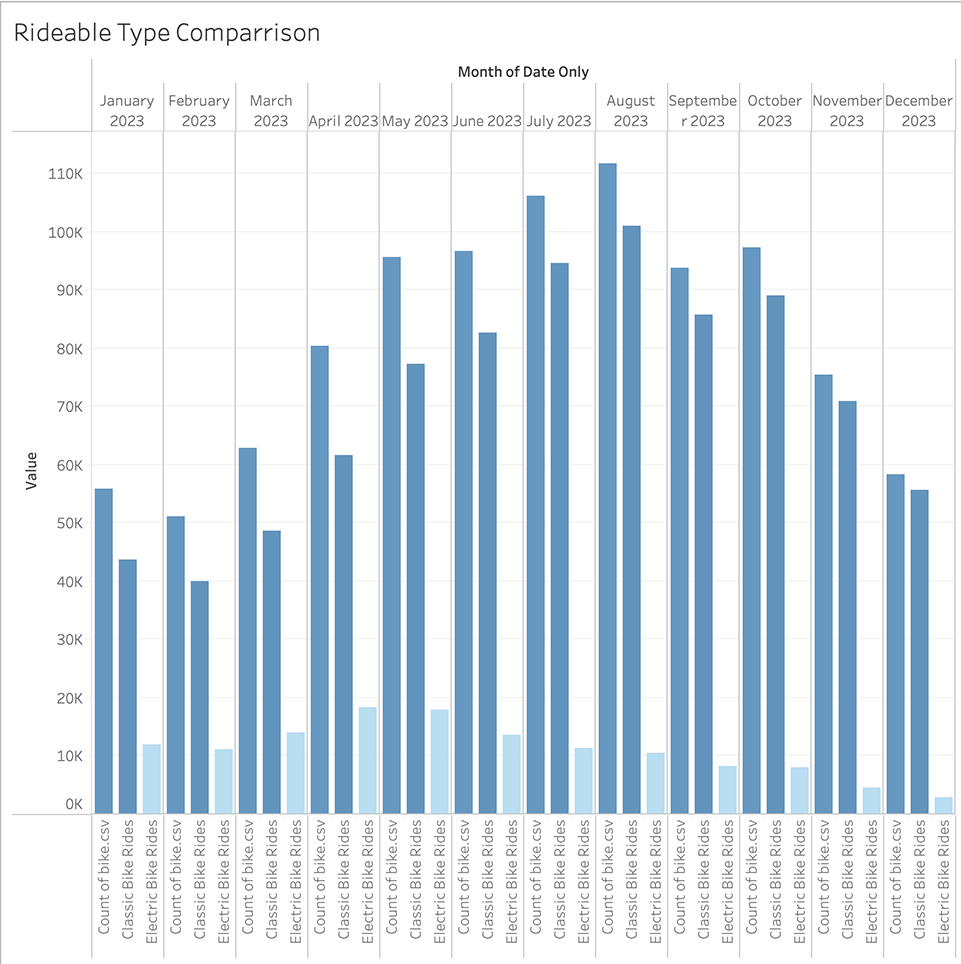

# Citi Bike Challenge: Data Preparation for Tableau Visualizations

## Overview
This project aims to aggregate data from the Citi Bike Trip History Logs to uncover two unexpected phenomena through comprehensive data analysis. Utilizing Python for data cleaning and combination, and Tableau for visualization, this project delves into various aspects such as trip length, seasons, weather conditions, and uses K-Means clustering alongside statistical regressions to explore correlations between bike rentals and weather patterns.

## Data Sources
- **Citi Bike Data:** 2023 trip data collected from [Citi Bike's official website](https://citibikenyc.com/system-data) comprising multiple CSV files.
- **Weather Data:** Additional weather data obtained from the [National Centers for Environmental Information (NCEI)](https://www.ncei.noaa.gov).

## Objectives
- To clean and combine CSV datasets for efficient analysis.
- To enhance the dataset with useful fields for deeper insights.
- To visualize and analyze the data using Tableau, focusing on:
  - Trip lengths
  - Seasonal effects
  - Weather impacts
  - Clustering using K-Means
  - Statistical regression to compare bike rentals against weather patterns

## Visualizations
- Regression scatter plots
- Geographic maps
- Bar charts
- [Other visualization types]

## Project Structure
citi_bike_challenge/ 
│ 
├── data/ # Directory for raw and processed data 
├── notebooks/ # Jupyter notebooks for exploration and analysis 
├── visualizations/ # Tableau visualization files and related resources 
└── README.md